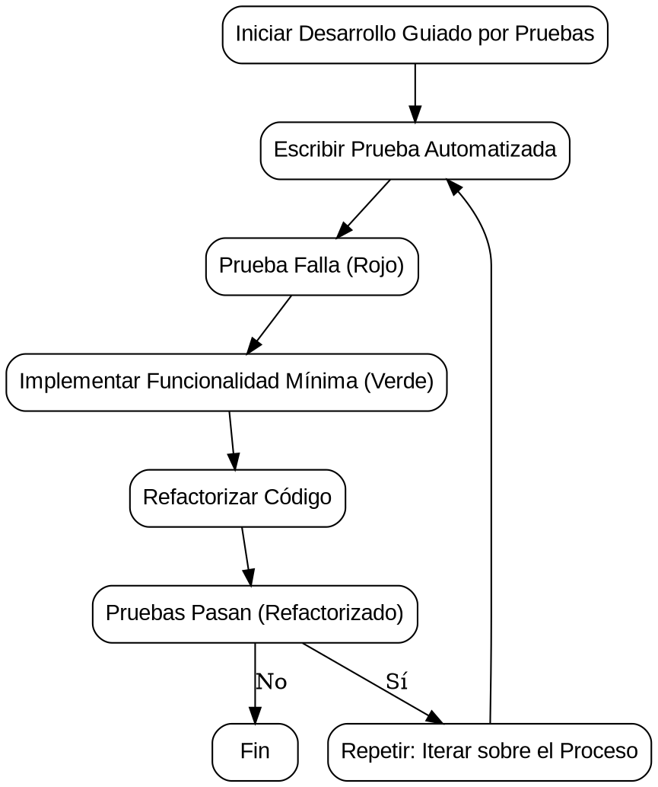

# Unit Testing con C# y .NET

Antes de hablar de pruebas unitarias, considero que es importante hablar de *Test Driven Development* (TDD) o en español, Desarrollo Guiado por Pruebas, es una **metodología de desarrollo de software** que se basa en **escribir pruebas automatizadas antes de escribir el código de producción**.


FLujo



Es acá cuando cobra importancia las pruebas unitarias. El **Unit Testing** es una práctica de desarrollo de software que implica escribir pruebas automatizadas para evaluar unidades individuales de código, generalmente funciones o métodos, de manera aislada. En el contexto de C# y .NET, **Unit Testing** se realiza utilizando un marco de prueba como NUnit, xUnit, MSTest, entre otros.

La práctica de **Unit Testing** es esencial en el desarrollo de software porque proporciona beneficios como la detección temprana de errores, facilita el mantenimiento del código, mejora la calidad del software y proporciona confianza al realizar cambios en el código existente. Además, la automatización de pruebas permite realizar pruebas de manera eficiente y repetitiva durante el desarrollo.

## Conceptos clave
### Unidad de Prueba (Test Unit)
Una unidad de prueba es la unidad más pequeña de código que se puede probar de manera aislada. En C# y .NET, una unidad de prueba suele ser un método o función individual.

### Framework de Pruebas (Test Framework)
Es un conjunto de herramientas y convenciones que facilitan la creación, organización y ejecución de pruebas unitarias. En .NET, los frameworks de pruebas populares son NUnit, xUnit y MSTest.

### Aserciones (Assertions)
Son expresiones que verifican si un resultado esperado es igual al resultado real de la ejecución de una unidad de código. Las aserciones se utilizan para verificar que el código funciona según lo previsto.

### Fixture
Es un entorno de prueba que proporciona un conjunto conocido de datos o condiciones para que las pruebas se ejecuten. Los *fixtures* ayudan a establecer un estado inicial consistente para las pruebas.

### Pruebas Automatizadas (Automated Tests)
Las pruebas automatizadas son *scripts* o fragmentos de código que realizan la ejecución de pruebas de manera automática. Estas pruebas se ejecutan frecuentemente durante el ciclo de desarrollo para garantizar la integridad del código.

### Cobertura de Código (Code Coverage)
Es la medida que indica cuánto del código fuente está cubierto por las pruebas. La cobertura de código es una métrica importante para evaluar la calidad de las pruebas unitarias.

### Mocking
Es una técnica que implica la creación de objetos simulados (mocks) para simular el comportamiento de componentes del sistema durante las pruebas. Esto permite aislar la unidad de código que está siendo probada.

### Pruebas de Integración
Aunque el enfoque principal del Unit Testing es probar unidades individuales de código, las pruebas de integración también son importantes. Estas pruebas evalúan cómo las diferentes unidades interactúan entre sí.

## Librerías de pruebas

*******************

# Pruebas unitarias con xUnit

## Creando tu primera prueba

### Visual Studio Code

Con **Visual Studio Code**, siguiendo la guia de **Microsoft**, debemos seguir los siguientes pasos:

1. Crear una solucion en la carpeta raiz donde estaba la carpeta del proyecto de libreria

`dotnet new sln --name UnitTestingNetCSharp`

1. creo el proyecto de test

`dotnet new xunit -o StringManipulationTest`

1. agrego ambos proyectos a la solucion

`dotnet sln add StringManipulation/StringManipulation.csproj dotnet sln add StringManipulationTest/StringManipulationTest.csproj`

1. luego agrego al proyecto de test la referencia al proyecto de la libreria

`dotnet add StringManipulationTest/StringManipulationTest.csproj reference StringManipulation/StringManipulation.csproj`

### En visual Studio

> Normalmente no se mezclan los proyectos de prueba con los proyectos de negocio.

1. Vamos a crear un nuevo proyecto dentro de la misma solución ➡️
    * Por **buenas prácticas**, el estandar recomienda que el nombre del proyectos de pruebas incluya el nombre del proyecto a probar: `StringManipulation.Tests`

2. Crear archivo de pruebas (una clase) para el proyecto ➡️ 
    * Por **buenas prácticas** se recomienda que la clase de pruebas lleve el mismo nombre incluya el mismo nombre de la clase que se va a probar: `StringOperations.Test`

3. Agregar la referencia del proyecto que tiene la clase del proyecto que se va a probar ➡️
    * Clic derecho en Dependencias, Agregar referencia
    * Seleccionamos el nombre del proyecto, clic en aceptar

### Crear una prueba

una vez referenciado el proyecto, creamos una prueba asociada a la funcionalidad que deseamos probar, en este caso, Comenzaremos con el primer método de la clase `StringOperation`.

> Siempre las clases de pruebas deben ser públicas.

1. Para que un método sea un caso de prueba, debemos agregar la etiqueta `[Fact]`. Una vez hecho, definimos un método público tipo `void` con el mismo nombre de la funcionalidad a probar.
    * <kbd>Nota:</kbd> Debemos agregar el `using Xunit;` para acceder a sus diferentes funcionalidades
2. Para este caso, crearemos un objeto del tipo de la clase base que estamos probando.
3. Implementamos una variable en donde vamos a guardar el resultado del método a probar.
4. Utilizamos la clase `Assert` y su método `Equal`, aqui probaremos lo que esperamos recibir, respecto a lo que estamos recibiendo.
5. En Visual Studio tenemos la funcionalidad del *Test Explorer*, para hacer la ejecución de las pruebas

## Estructura AAA

La estructura AAA se refiere a un enfoque comúnmente utilizado en el desarrollo de pruebas unitarias, y se compone de tres fases principales: Arrange, Act y Assert. Estas tres fases describen la secuencia lógica que se sigue al escribir una prueba unitaria. A continuación, se detallan cada una de las fases de la estructura AAA:

**1. Arrange (Preparar):**
En esta fase, se prepara el escenario para la prueba. Esto implica configurar el estado inicial necesario para ejecutar la prueba. Se crean instancias de objetos, se establecen valores iniciales y se configuran condiciones previas para la prueba.

**1. Act (Actuar):**
En esta fase, se realiza la acción o se invoca el método que se está probando. Es el paso donde se ejecuta la operación que se quiere verificar. Se trata de la acción específica que estás probando en la unidad de código.

**1. Assert (Verificar):**
En esta fase, se verifica el resultado de la acción realizada en la fase "Act". Se comprueba si el resultado es el esperado según las condiciones definidas en la fase "Arrange". Si el resultado coincide con las expectativas, la prueba se considera exitosa; de lo contrario, se considera fallida.

### Ejemplo

Supongamos que queremos probar una simple función que suma dos números. Aquí tienes un ejemplo utilizando la estructura AAA en C# con un framework de pruebas como NUnit:

```csharp
// Arrange (Preparar)
int numero1 = 5;
int numero2 = 7;
int resultadoEsperado = 12;

// Act (Actuar)
int resultadoReal = MiClase.SumarNumeros(numero1, numero2);

// Assert (Verificar)
Assert.Equal(resultadoEsperado, resultadoReal);

```

## Principios testing FIRST

testing FIRST son una guía que destaca los aspectos clave a considerar al escribir pruebas unitarias efectivas. La palabra "FIRST" es un acrónimo que representa los siguientes principios: Fast, Isolated/Independent, Repeatable, Self-validating, and Timely. A continuación, se describen cada uno de estos principios con ejemplos:

### Fast (Rápido):

Las pruebas unitarias deben ejecutarse rápidamente, lo que significa que deben completarse en un corto período de tiempo. Las pruebas lentas pueden afectar la productividad del equipo y reducir la frecuencia con la que se ejecutan las pruebas.

```csharp
// Ejemplo: Verificar que una función simple retorna el resultado esperado.
[Test]
public void SumarNumeros_DosNumerosPositivos_RetornaSuma()
{
    int resultado = MiClase.SumarNumeros(3, 5);
    Assert.AreEqual(8, resultado);
}

```

### Isolated/Independent (Aislado/Independiente):

Cada prueba unitaria debe ser independiente y no depender del resultado de otras pruebas. La ejecución de una prueba no debe afectar el resultado de otras pruebas.

```c#
// Ejemplo: Prueba de una función de multiplicación, sin depender de otras pruebas.
[Test]
public void MultiplicarNumeros_DosNumerosPositivos_RetornaProducto()
{
    int resultado = MiClase.MultiplicarNumeros(4, 6);
    Assert.AreEqual(24, resultado);
}

```

### Repeatable (Repetible):

Las pruebas deben ser repetibles y producir los mismos resultados cada vez que se ejecutan. Esto garantiza que las pruebas sean confiables y predecibles.

```c#
// Ejemplo: Prueba de una función que verifica si un número es par.
[Test]
public void EsPar_NumeroPar_RetornaTrue()
{
    bool resultado = MiClase.EsPar(10);
    Assert.IsTrue(resultado);
}

```

### Self-validating (Autovalidación):

Las pruebas deben ser autovalidantes, es decir, deben proporcionar una respuesta clara sobre si han pasado o fallado. La interpretación del resultado no debe depender de la observación del desarrollador.

```c#
// Ejemplo: Prueba de una función que verifica si un número es negativo.
[Test]
public void EsNegativo_NumeroNegativo_RetornaTrue()
{
    bool resultado = MiClase.EsNegativo(-7);
    Assert.IsTrue(resultado);
}

```

### Timely (Oportuno):

Las pruebas deben escribirse de manera oportuna, es decir, antes de escribir el código de producción correspondiente. Es preferible seguir el enfoque TDD (Desarrollo Guiado por Pruebas) y escribir pruebas antes de implementar la funcionalidad.

```c#
// Ejemplo: Escribir una prueba antes de implementar la función SumarNumeros.
[Test]
public void SumarNumeros_DosNumerosNegativos_RetornaSuma()
{
    int resultado = MiClase.SumarNumeros(-2, -4);
    Assert.AreEqual(-6, resultado);
}

```


## Tipos de Assert

En el contexto de pruebas unitarias, un "assert" (afirmación) es una expresión que verifica si una condición es verdadera o falsa. Los asserts se utilizan para validar que el comportamiento del código bajo prueba coincide con las expectativas definidas en la prueba. Cuando una afirmación falla, la prueba se considera no válida, y se proporciona información sobre la discrepancia.

Tabla 1.
| Tipo de Assert                         | Aplicación                                               | Ejemplo                                                    |
|-----------------------------------------|----------------------------------------------------------|------------------------------------------------------------|
| `Assert.Equal(expected, actual)`        | Verifica si dos valores son iguales.                    | `Assert.Equal(10, Calculadora.Sumar(6, 4));`               |
| `Assert.NotEqual(expected, actual)`     | Verifica si dos valores no son iguales.                 | `Assert.NotEqual("Hola", "Mundo");`                        |
| `Assert.True(condition)`                | Verifica si la condición es verdadera.                  | `Assert.True(Calculadora.EsNumeroPar(8));`                |
| `Assert.False(condition)`               | Verifica si la condición es falsa.                      | `Assert.False(Calculadora.EsNumeroNegativo(5));`          |
| `Assert.Null(object)`                   | Verifica si el objeto es nulo.                          | `Assert.Null(listaVacia.ObtenerPrimerElemento());`        |
| `Assert.NotNull(object)`                | Verifica si el objeto no es nulo.                       | `Assert.NotNull(Calculadora.ObtenerInstancia());`        |
| `Assert.Throws<Exception>(code)`        | Verifica si una excepción específica es lanzada.        | `Assert.Throws<DivideByZeroException>(() => Calculadora.Dividir(10, 0));` |
| `Assert.Contains(expectedSubstring, actualString)` | Verifica si una cadena contiene una subcadena específica. | `Assert.Contains("OpenAI", "OpenAI is amazing!");`       |
| `Assert.DoesNotContain(substring, actualString)`    | Verifica que una cadena no contenga una subcadena específica. | `Assert.DoesNotContain("Closed", "OpenAI is amazing!");`  |
| `Assert.Empty(collection)`              | Verifica si una colección está vacía.                   | `Assert.Empty(listaVacia);`                               |
| `Assert.NotEmpty(collection)`           | Verifica si una colección no está vacía.                | `Assert.NotEmpty(listaConElementos);`                     |
| `Assert.InRange(actual, low, high)`     | Verifica si un valor está dentro de un rango inclusivo. | `Assert.InRange(numero, 1, 10);`                           |
| `Assert.NotInRange(actual, low, high)`  | Verifica si un valor está fuera de un rango inclusivo.  | `Assert.NotInRange(numero, 11, 20);`                       |

## Atributos Theory e InlineData

 los atributos `Theory` y `InlineData` son utilizados para implementar teorías de pruebas parametrizadas, lo que permite ejecutar la misma prueba con diferentes conjuntos de datos de entrada. Esto facilita la escritura y mantenimiento de pruebas más robustas y versátiles.

### Ejemplo

```csharp
public class CalculadoraTests
{
    [Theory]
    [InlineData(2, 3, 5)]
    [InlineData(0, 0, 0)]
    [InlineData(-1, 1, 0)]
    public void Sumar_DeberiaSumarCorrectamente(int a, int b, int resultadoEsperado)
    {
        // Arrange
        Calculadora calculadora = new Calculadora();

        // Act
        int resultadoActual = calculadora.Sumar(a, b);

        // Assert
        Assert.Equal(resultadoEsperado, resultadoActual);
    }
}

```

 El método `Sumar_DeberiaSumarCorrectamente` se marca con el atributo `Theory`, indicando que es una teoría. Luego, el atributo `InlineData` se usa para proporcionar conjuntos de datos de entrada diferentes para la misma prueba. En este caso, la prueba se ejecutará tres veces con diferentes valores de entrada y verificará si la suma se realiza correctamente en cada caso.

 ### Atributo Skip

 El atributo `Skip` en xUnit se utiliza para marcar una prueba como omitida, lo que significa que la prueba no se ejecutará. Puedes utilizar este atributo para evitar que ciertas pruebas se ejecuten bajo ciertas condiciones o escenarios. Esto puede ser útil, por ejemplo, cuando una prueba no es aplicable en ciertos contextos o cuando estás trabajando en una funcionalidad que aún no está implementada.

Puedes proporcionar una razón opcional como una cadena para explicar por qué se ha omitido la prueba. 

```csharp
public class EjemploPruebas
{
    [Fact]
    public void PruebaImportante()
    {
        // Esta prueba es importante y debería ejecutarse normalmente.
        Assert.True(true);
    }

    [Fact(Skip = "Esta prueba aún no está implementada")] // 👈 implementing skip
    public void PruebaNoImplementada()
    {
        // Esta prueba se omitirá y no se ejecutará.
        Assert.True(false);  // Esta línea nunca se alcanzará.
    }

    [Theory]
    [InlineData(1, 2, 3)]
    [InlineData(4, 5, 9)]
    [InlineData(10, 20, 30)]
    [InlineData(100, 200, 300)]
    public void PruebaParametrizada(int a, int b, int resultadoEsperado)
    {
        // Esta prueba parametrizada se ejecutará normalmente.
        Assert.Equal(resultadoEsperado, a + b);
    }

    [Fact(Skip = "Esta prueba está deshabilitada temporalmente")]
    public void PruebaDeshabilitadaTemporalmente()
    {
        // Esta prueba se omitirá y no se ejecutará.
        Assert.True(false);  // Esta línea nunca se alcanzará.
    }
}

``` 

> Nota: si utilizamos el atributo skip debemos crear un ticket en nuestro backlog indicando el momento en el que se va a dar solución al caso

### Librerías

Comparación entre librerías. Ene el siguiente recurso encontrás una comparación de sintaxis entre las diferentes librerías. [Link](https://xunit.net/docs/comparisons) 

...................

# Librería moq

## Concepto de mock y libreria moq en .NET

El ***mocking*** es una técnica utilizada en pruebas unitarias para simular el comportamiento de objetos o componentes externos con el fin de aislar la unidad de código bajo prueba. En lugar de utilizar implementaciones reales de dependencias, se crean objetos simulados (mocks) que imitan el comportamiento esperado durante las pruebas.

Supongamos que tienes una clase `Calculadora` que realiza operaciones matemáticas y utiliza una interfaz `IServicioLogger` para registrar eventos. Queremos probar el método `Dividir()` de la Calculadora pero sin afectar realmente al servicio de registro de eventos.

### Ejemplo

```csharp
public interface IServicioLogger
{
    void Registrar(string mensaje);
}

public class Calculadora
{
    private readonly IServicioLogger _servicioLogger;

    public Calculadora(IServicioLogger servicioLogger)
    {
        _servicioLogger = servicioLogger;
    }

    public int Dividir(int dividendo, int divisor)
    {
        if (divisor == 0)
        {
            _servicioLogger.Registrar("Intento de dividir por cero.");
            throw new ArgumentException("El divisor no puede ser cero.");
        }

        return dividendo / divisor;
    }
}

```

Ahora, en nuestras pruebas unitarias, podemos usar Moq para crear un mock de IServicioLogger y verificar que el método Registrar se llama correctamente sin afectar el verdadero servicio de registro de eventos.

```csharp
using Moq;
using Xunit;

public class CalculadoraTests
{
    [Fact]
    public void Dividir_CuandoDivisorNoEsCero_RegistraEvento()
    {
        // Arrange
        var mockServicioLogger = new Mock<IServicioLogger>();
        var calculadora = new Calculadora(mockServicioLogger.Object);

        // Act
        calculadora.Dividir(10, 2);

        // Assert
        mockServicioLogger.Verify(s => s.Registrar(It.IsAny<string>()), Times.Once);
    }

    [Fact]
    public void Dividir_CuandoDivisorEsCero_LanzaExcepcionYRegistraEvento()
    {
        // Arrange
        var mockServicioLogger = new Mock<IServicioLogger>();
        var calculadora = new Calculadora(mockServicioLogger.Object);

        // Act & Assert
        Assert.Throws<ArgumentException>(() => calculadora.Dividir(10, 0));

        // Verificar que se llamó al método Registrar cuando se intentó dividir por cero.
        mockServicioLogger.Verify(s => s.Registrar("Intento de dividir por cero."), Times.Once);
    }
}

```

### Implementar un Moq

1. Agregar la librería (por Nugget | CLI) ➡️  "Moq by Daniel Cazullino"
2. Antes de instanciar el objeto de la clase que se está probando, hacemos las instancia del Mock

..................

### Mock de funciones

...

# Cobertura de pruebas unitarias 

La cobertura de pruebas unitarias es una **métrica que mide la cantidad de código fuente que ha sido ejecutada durante la ejecución de un conjunto de pruebas unitarias**. En otras palabras, indica **qué porcentaje del código fuente ha sido "cubierto" por las pruebas**. Una cobertura más alta suele indicar un conjunto de pruebas más exhaustivo y, por lo tanto, una mayor confianza en la calidad del código.

## Cobertura de prubas unitarias con Coverlet

**Coverlet** es una herramienta de código abierto para medir la cobertura de código en aplicaciones `.NET`. Puede integrarse fácilmente con el marco de pruebas xUnit, NUnit o MSTest para proporcionar información detallada sobre qué partes del código han sido cubiertas por las pruebas.

### Ejecutar Pruebas con Cobertura:

1.**Instalar Coverlet.Global:** Abre la consola de NuGet en tu proyecto y ejecuta el siguiente comando ➡️ `dotnet tool install --global coverlet.console`
2. **Ejecutar Pruebas con Cobertura:** Ejecuta tus pruebas unitarias con el siguiente comando ➡️ `dotnet test /p:CollectCoverage=true /p:CoverletOutputFormat=lcov`
3. **Visualizar Informes de Cobertura:** Puedes usar herramientas como ReportGenerator para convertir el formato de salida (por ejemplo, lcov) en informes HTML que son más fáciles de entender. ➡️ `dotnet reportgenerator -reports:coverage.info -targetdir:coverlet-report -reporttypes:Html`
